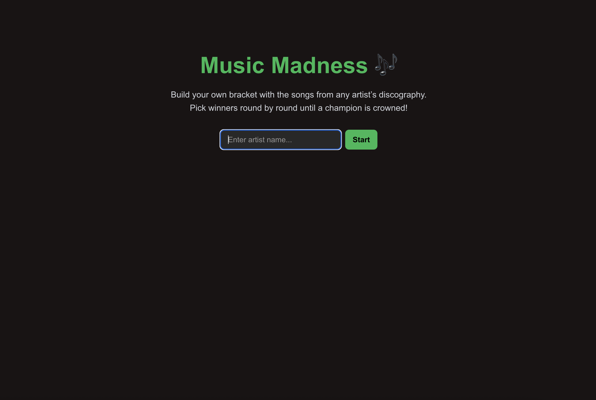
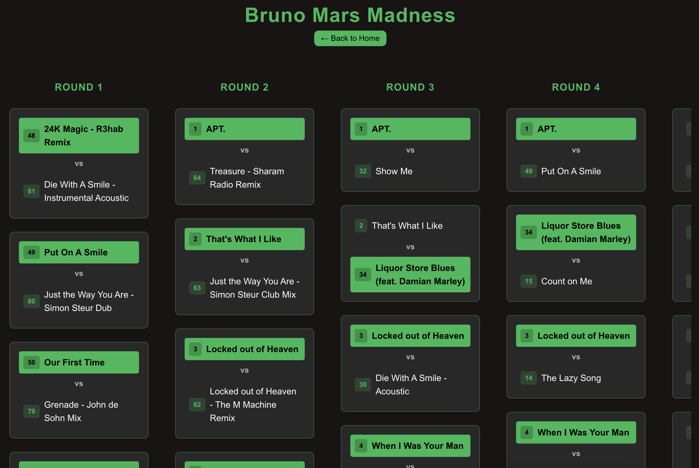
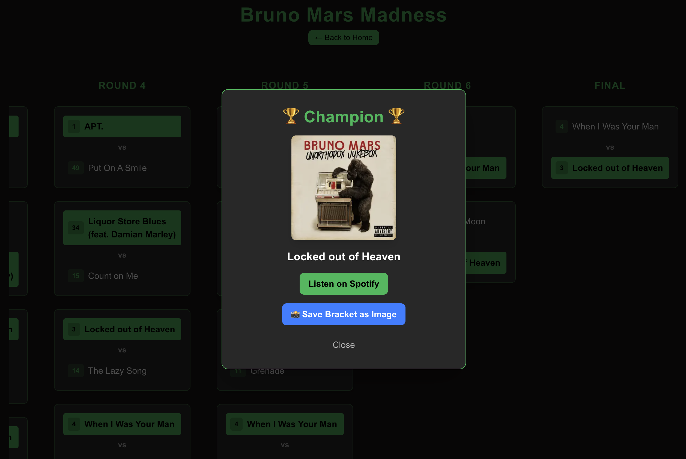

# 🎶 Music Madness – Song Bracket Generator

An interactive web app that generates head-to-head tournament brackets from an artist’s discography, letting users pick winners until a champion song is crowned.

## 🚀 Live Demo
👉 [music-madness.vercel.app](https://music-madness.vercel.app)

## ✨ Features
- 🔍 **Artist Search** – Enter any artist’s name to instantly pull their discography using the Spotify API  
- 🎶 **Automatic Song Import** – Fetches track titles, album covers, and metadata directly from Spotify (no manual entry)  
- 🏆 **Bracket Generator** – Randomizes songs into a single-elimination tournament bracket  
- ✅ **Duplicate Handling** – Case-insensitive merging (e.g., “True Love” vs “TRUE LOVE” or "INDUSTRY BABY" vs "INDUSTRY BABY (feat. Jack Harlow)" count as the same song)  
- ⭐ **Song Popularity Ranking** – Automatically sorts songs by Spotify popularity score, so the biggest hits rise to the top  
- 🎧 **Spotify Previews** – Play previews of songs directly from Spotify before making your pick  
- 💾 **Save & Share Brackets** – Export or share your finished bracket so friends can compare results  
- 🖥️ **Interactive UI** – Progress through rounds by selecting winners with a clean, responsive bracket interface  
- 📌 **Quality of Life Features** – Sticky headers, dynamic tab names, and auto-advancing when matchups are empty  

## 🛠️ Tech Stack
- **Frontend:** React, Next.js, JavaScript (ES6+)
- **Styling:** Tailwind CSS
- **Deployment:** Vercel
- **Music Data:** [Spotify Web API](https://developer.spotify.com/documentation/web-api/) 
- **Version Control:** Git + GitHub

## 📸 Screenshots




## 📦 Getting Started (For Developers)
```bash
# Clone the repo
git clone https://github.com/andrewkdawson/music-madness.git

# Install dependencies
npm install

# Run locally
npm run dev